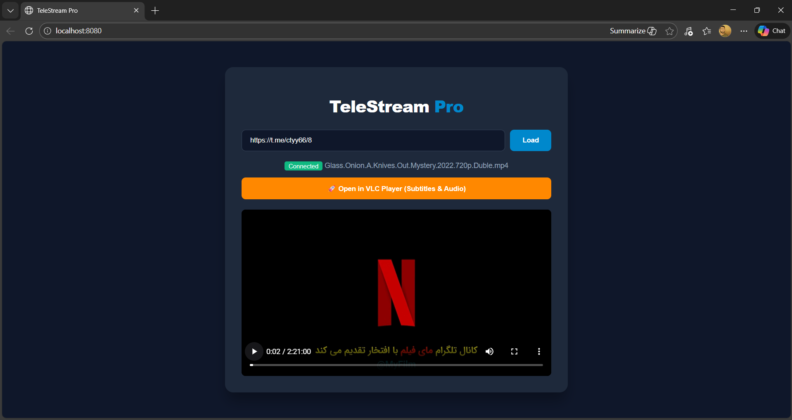

# 📺 TeleStream Pro

**TeleStream Pro** is a lightweight Windows application that allows you to stream videos directly from Telegram channels to your web browser or **VLC Media Player** without downloading the full file first.

Built with Python, Telethon, and aiohttp, it provides a seamless bridge between Telegram's cloud storage and your favorite media players, supporting **custom audio tracks** and **subtitles** via VLC integration.

---

## 📸 Showcase

### 🎥 Demo Video

---

## 🚀 Features

- **Direct Streaming:** No need to wait for 2GB+ movies to download. Start watching instantly.
- **VLC Integration:** One-click button to launch VLC with the stream, enabling:
  - Toggle Subtitles (on/off).
  - Change Audio Tracks (Multiple languages).
  - Advanced video adjustments.
- **Modern Web UI:** Clean, dark-mode interface for ease of use.
- **Secure:** Uses official Telegram API.
- **Installer Support:** Can be packaged into a professional `.exe` or `Setup.exe`.

---

## 🛠️ Installation & Setup

### 1. Prerequisites
- [Python 3.10+](https://www.python.org/)
- [VLC Media Player](https://www.videolan.org/vlc/) (For advanced features)
- Telegram API Keys (Get them from [my.telegram.org](https://my.telegram.org))

### 2. Clone the Repository

git clone https://github.com/eul45/telestream-pro.git
cd telestream-pro

### 3. Install Dependencies

pip install -r requirements.txt

### 4. Configuration
To connect this app to Telegram, you need to add your own API credentials.
Obtain your API_ID and API_HASH from the [Telegram API Development Tools](https://my.telegram.org).
Open `player.py` in a text editor.
Locate the `--- CONFIG ---` section (Lines 10-11) and replace the values:

# --- CONFIG ---
API_ID = 12345678           # Paste your API ID here (as a number)
API_HASH = 'your_api_hash'  # Paste your API HASH here (inside quotes)

### 5. Run the App

python player.py

---

## 📦 Building the Executable
To create a standalone Windows `.exe` file:

1. **Install PyInstaller:**

pip install pyinstaller

2. **Build:**

pyinstaller --onefile --name="TeleStreamPro" player.py

---

## 🛡️ Safety & Disclaimer
- **Privacy:** This app does not store your Telegram data. The `.session` file is stored locally on your machine.
- **API Limits:** Please follow Telegram's Terms of Service. Excessive streaming may result in temporary flood waits from Telegram.
- **Secrets:** NEVER share your `.env` or `.session` files. They are included in the `.gitignore` to prevent accidental uploads.

---

## 🤝 Contributing
Contributions, issues, and feature requests are welcome! Feel free to check the issues page.

Created with ❤️ by Eyuel Engida"# telestream-pro" 
